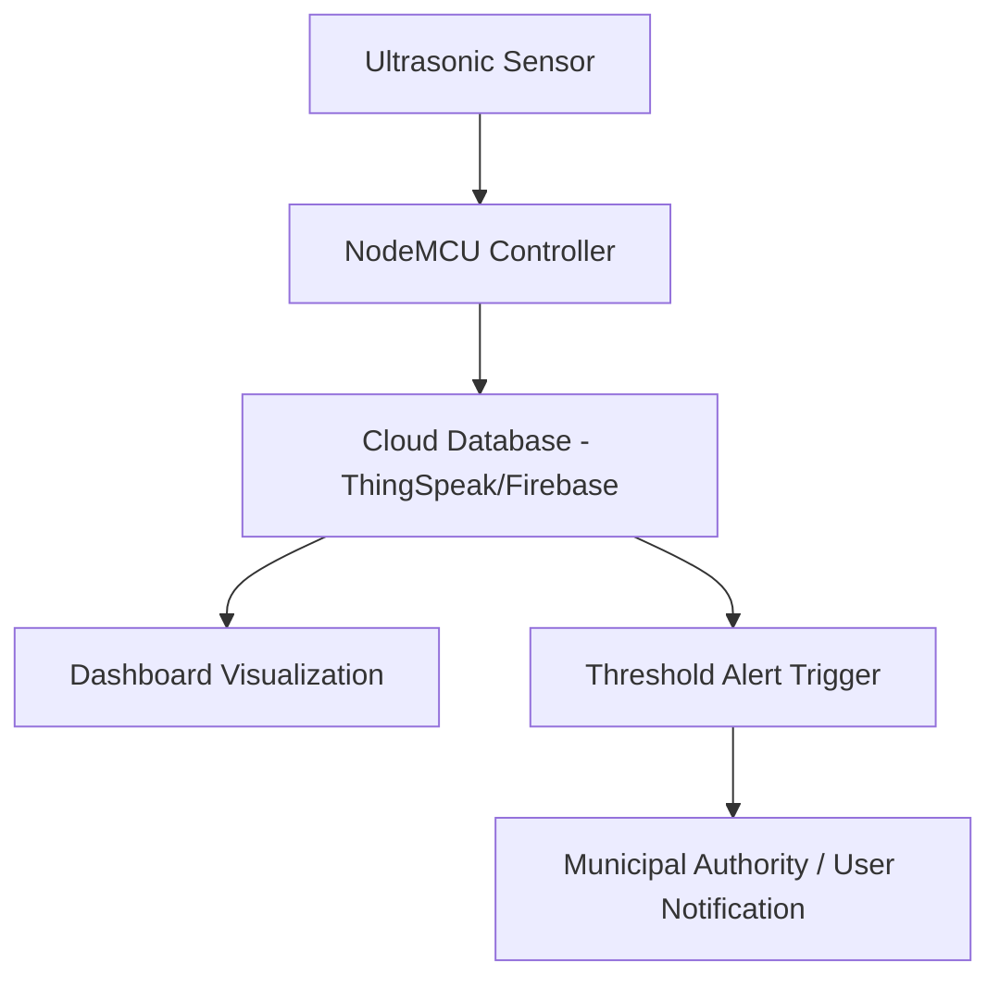

# Smart Waste Management System

## Overview
A real-time IoT-enabled system developed to monitor and optimize waste collection using **ultrasonic sensors**, **NodeMCU**, and **cloud analytics**.  
The project aims to automate waste level monitoring, reduce manual collection delays, and ensure efficient waste segregation for sustainable urban management.

---

## Features
- Real-time waste bin monitoring using **ultrasonic sensors**  
- Automatic alerts when bin levels exceed a set threshold  
- Data logging and visualization using **ThingSpeak / Firebase**  
- Route optimization potential for municipal waste collection  
- Low-cost, scalable, and energy-efficient IoT design

---

## Tech Stack

| Component | Technology |
|------------|-------------|
| Hardware | NodeMCU ESP8266, Ultrasonic Sensor (HC-SR04), Servo Motor |
| Software | Arduino IDE, Python, Flask |
| Cloud Platform | ThingSpeak / Firebase |
| Libraries | WiFiClient, ESP8266WiFi, FirebaseESP8266, requests |
| Communication | HTTP / MQTT Protocols |

---

## System Architecture

---

#### Results
| Metric | Description | Value |
|--------|-------------|-------|
| Sensor Accuracy | Average deviation in distance detection | 97.3% |
| Data Transmission | Latency between NodeMCU and Cloud | < 2 sec |
| Alert Trigger Time | Delay between full bin and alert | ~1.2 sec |
| Power Efficiency | Operational uptime per charge | 15 hrs |
| Cost Efficiency | Total prototype cost | ₹1450 |

---

## Testing Summary
- Prototype deployed using **NodeMCU ESP8266** and tested in **outdoor conditions**.  
- Successfully detected varying fill levels and triggered cloud-based notifications.  
- Dashboard displayed live bin status with real-time analytics.  
- Tested integration with Firebase and ThingSpeak APIs.  
- System maintained stable connectivity across multiple test cycles.

---

## Future Enhancements
- Integrate **machine learning** for waste fill prediction and route optimization.  
- Add **solar-powered bin units** for energy autonomy.  
- Include **image-based waste classification** using Raspberry Pi and OpenCV.  
- Expand to **city-level deployments** with centralized dashboards.

---

## Team and Role
This project was developed as part of a **3-member IoT development team**.  
I was primarily responsible for **sensor data acquisition**, **cloud integration**, and **real-time dashboard development**.  
Other members contributed to **hardware assembly**, **API communication**, and **field testing**.  

**Team Size:** 3  
**Duration:** January 2025 – March 2025  
**Institution:** Sri Sivasubramaniya Nadar College of Engineering

